# TEXTWORM APP

## Features
   * ### In app translator 
      * Translates the selected word into your desired language on tap
   * ### Texts in different languages reviewed by a real language teacher
      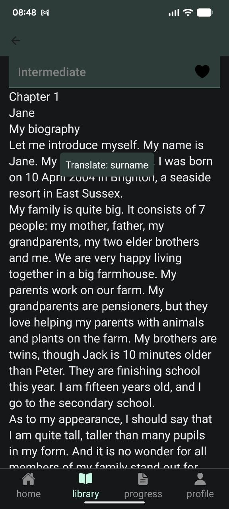
      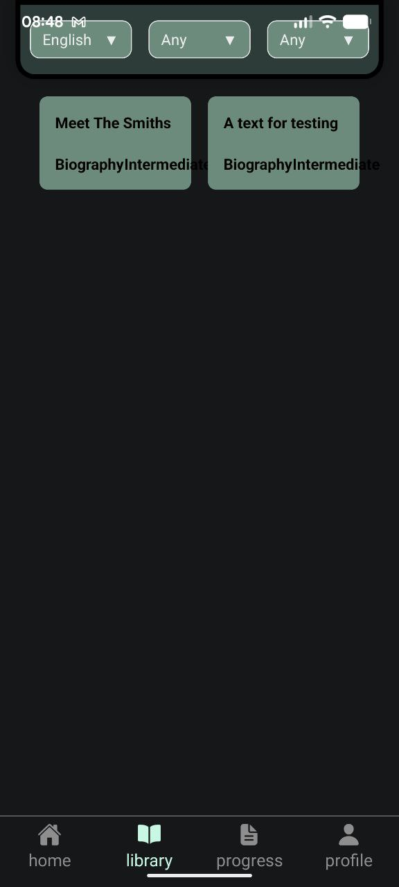

   * ### Exercises for texts
      * Multiple choice
         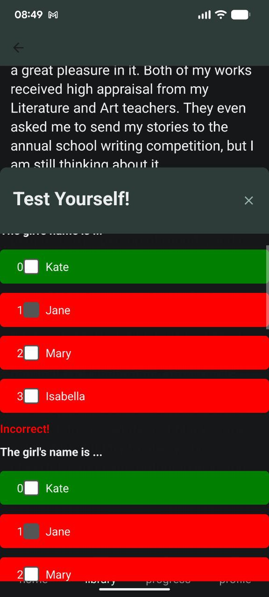
      * Fill in
         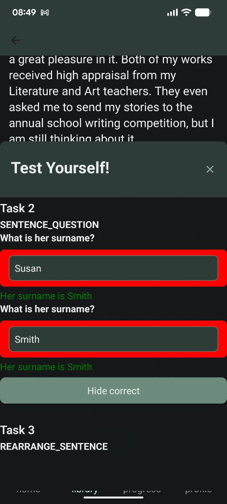
      * True or false
      * Rearrange sentence
         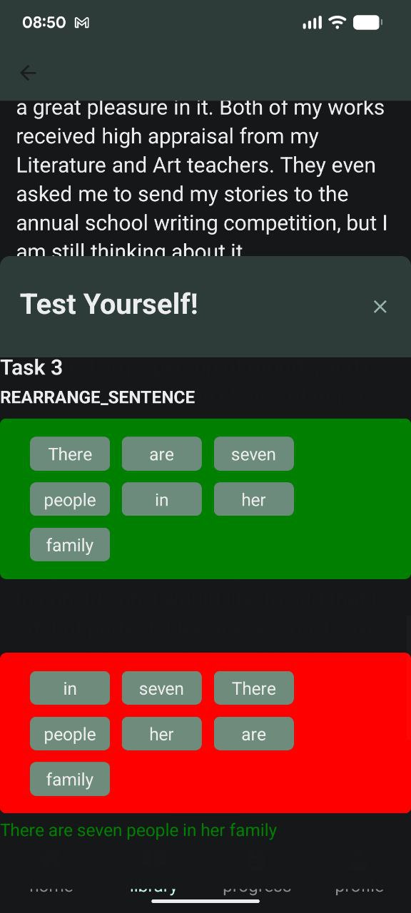
      * Odd one out
         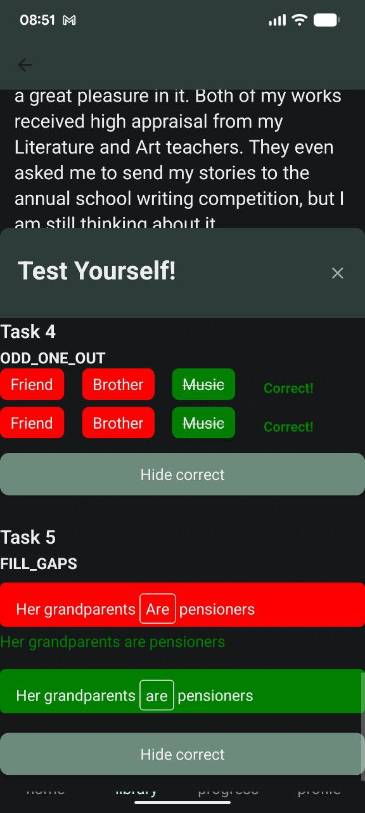
      * Fill the gaps
   * ### Account system
      * access tokens
      * login and password
      * creating a new account
      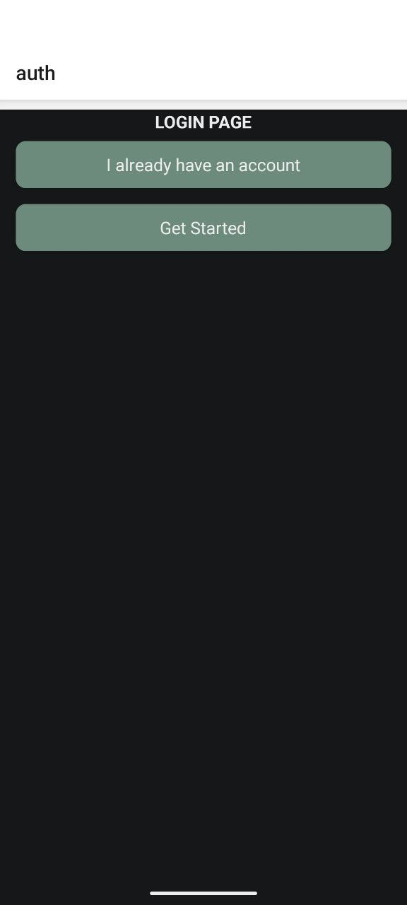
      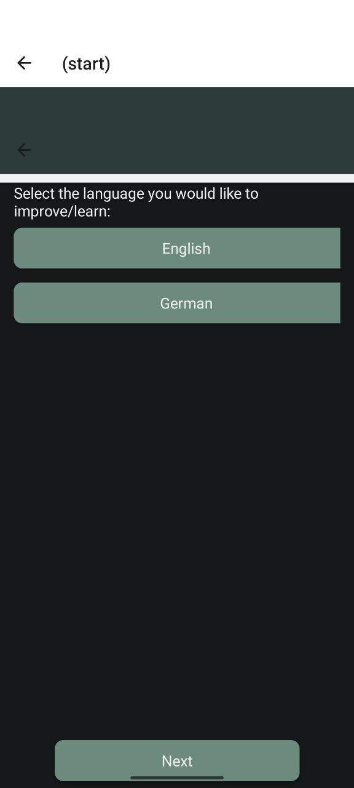
      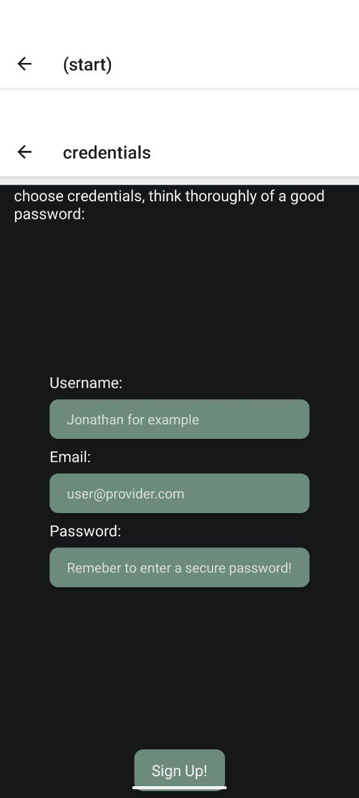
      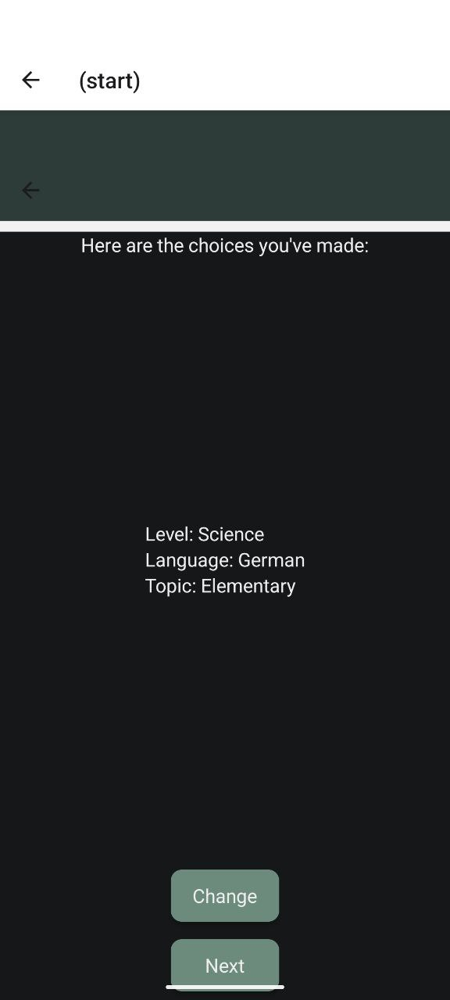
      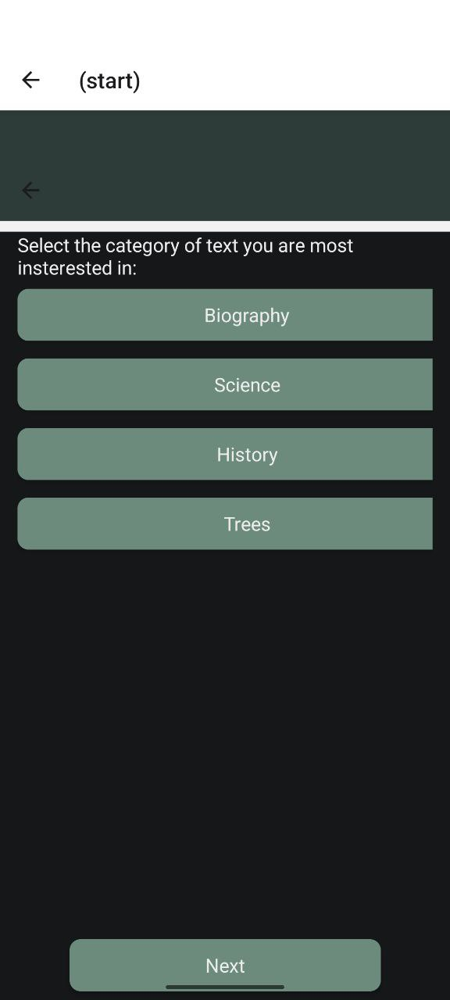
      
## Backend
* ### AWS services is used as the cloud backend
* ### AWS S3:
   * config
      * stores the filters for the search of texts in app
   * exercises
      * stores the exercises for texts in json format
   * texts
      * stores texts in txt format
* ### AWS Lambda:
   * links the 
* ### AWS DynamoDB:
   * Refresh tokens
      * stores the refresh tokens for the users
   * texts
      * links the items in the bucket(text files) to the names, etc...
   * users
      * links the user data(name, etc...) to the json files in the bucket
* ### API Gateway
   * Used to link the lambda scripts to end points

## Frontend
* ### React native is the base for the mobile app
* ### Android is currently the only OS supported, but the code can be easily compiled for IOS
* ### A fun design